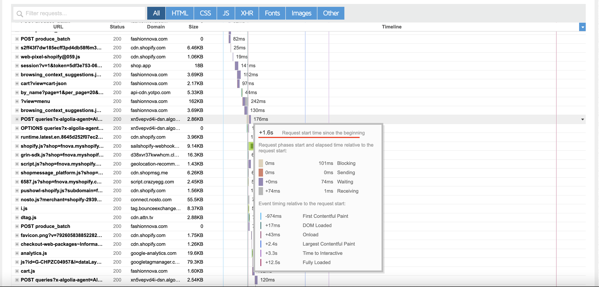

# Edge Components w/ HTML Streaming

This is a concept repo.
- It is all built using TransformStream’s
- It supports blocking and non-blocking components
- It supports sub-streams with blocking and non-blocking components
- It is all built around the Request interface, so independent edge caching can be applied to every level.
    - This also makes the concept compatible with existing edge-based solutions
    - This also allows the rendering of components to be offloaded to workers for platforms

# The Problem

On FashionNova’s PLP, the request to Algolia that fetches critical data required to render the entire collection page is not initiated until 1.6s into page load. The same happens with many Shopify merchants as third party apps load and inject content on the client-side.

************************************************FN does use a heavily client-side rendered Shopify Theme. Taking a more liquid-based approach would have had better performance. However, Liquid still cannot fetch data from Algolia.************************************************

# The (Potential) Solution

## Inspirations

- Remix - There is no server state or client state. It is all forms that can rerender. Responses are also streamed as they are built so that you do not have to wait for all data to be fetched for the entire page to render.
- EdgeMesh - Dynamic fragments, uncached fragments of the page that are loaded via web-worker for swift page loads with partial full page caching.

## Concept

Shopify Theme (origin) provides a page shell. Edge fetches the shell in parallel with fetching and rendering a basic product grid, filtering, and pagination. All functionality is in a form that submits (prevented) and refreshes the current "component.”

The HTMLRewriter is used to go over the original page contents and inject rendered components. While doing so, it builds a map that can be memoized to allow for parallel rendering of components and fetching of the original page on future requests.
